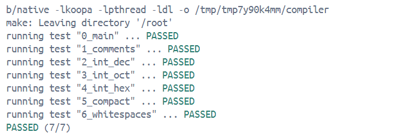

# 目的

实现一个能处理 main 函数和 return 语句的编译器.编译器可以将如下的 SysY 程序:

```
int main() {
  // 注释也应该被删掉哦
  return 0;
}
```

编译为对应的 Koopa IR:

```
fun @main(): i32 {
%entry:
  ret 0
}
```

# 实现

## Lv1.2. 词法/语法分析初见

我使用项目提供的c++模板，直接执行：

```
make
build/compiler -koopa hello.c -o hello.koopa
```

输出：

```
int main() { return 0; }
```

这是因为默认的模板使用string存放ast，所以输出的ast也是string形式：

```
CompUnit
  : FuncDef {
    ast = unique_ptr<string>($1);
  }
  ;
```

## Lv1.3. 解析 main 函数

这里设计一个ast用于输出程序的语法结构，教程写的已经很详细了：写一个头文件来定义AST,对于头文件重复声明的问题，加上`#pragma once`就可以解决。

我是这样定义基类和子类进行构造的：

```
// 所有 AST 的基类
class BaseAST {
 public:
  virtual ~BaseAST() = default;
  virtual void Dump() const = 0;
};

// CompUnit 是 BaseAST
class CompUnitAST : public BaseAST {
 public:
  // 用智能指针管理对象
  std::unique_ptr<BaseAST> func_def;

    void Dump() const override {
    std::cout << "CompUnitAST { ";
    func_def->Dump();
    std::cout << " }";
  }
};
……
```

同时，修改参数类型的相关声明：比如`%parse-param { std::unique_ptr<string> &ast }
`改为`%parse-param { std::unique_ptr<BaseAST> &ast }
`

make之后就会输出`CompUnitAST { FuncDefAST { FuncTypeAST { int }, main, BlockAST { StmtAST { 0 } } } }
`。


## Lv1.4. IR 生成

我采用定义 AST 一样定义表示 Koopa IR 的数据结构, 然后遍历 AST 输出这种结构, 再遍历这种结构输出字符串。

类似的，写一个KoopaIR头文件，定义它的结构：

```
// Value 是所有指令和常量的基类
class Value {
 public:
  virtual ~Value() = default;
  virtual void Dump() const = 0;
};

// 整数常量
class Integer : public Value {
 public:
  int value;
  
  Integer(int v) : value(v) {}
  
  void Dump() const override {
    std::cout << value;
  }
};
```

接着完成`GenerateIR`的工作，完成遍历 AST 生成 IR，由于只需要识别main函数就可以了，复杂一些的递归之类的暂时不需要写。

```
main.cpp
  │
  ├─ yyparse(ast)          // 调用 Bison/Flex 解析源码 → 得到 AST
  │
  ├─ GenerateIR(*ast)      // ← 遍历 AST，生成 Koopa IR (Program)
  │     └─ IRGenerator.cpp
  │          ├─ dynamic_cast<CompUnitAST*> 取出 func_def
  │          ├─ dynamic_cast<FuncDefAST*>  取出 ident + block
  │          ├─ dynamic_cast<BlockAST*>    取出 stmt
  │          ├─ dynamic_cast<StmtAST*>     取出 num
  │          └─ 构建 Return(Integer(num)) → BasicBlock → Function → Program
  │
  └─ program->Dump()       // 以文本格式输出 Koopa IR
```

## Lv1.5. 测试

有一个小问题，模板给出的sysy.l没有给出注释块的定义，需要我们自己加上`BlockComment  "/*"(.|\n)*?"*/"`,否则测试的时候会有一个测试点不过。

测试结果：
